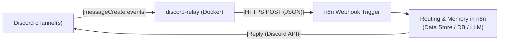

# docker-discord-relay

A tiny Dockerized **Discord → n8n relay** that listens for messages in selected channels and forwards them to an **n8n Webhook Trigger**. Supports both **prefix commands** (e.g., `!help`) and **conversational chat** (mention/DM/reply triggers). Includes identity payloads so you can build **per-user long-term memory** in n8n.

> Repo: `https://github.com/rbibbey/docker-discord-relay`

---

## Architecture



Discord channel(s)  -->  discord-relay (Docker)  -->  n8n Webhook Trigger  -->  Routing & Memory in n8n
       ^                                                                                              |
       |------------------------------------ Reply (Discord API) -------------------------------------|

---

## Quick Start

### 1) Clone

```bash
git clone https://github.com/rbibbey/docker-discord-relay.git
cd docker-discord-relay/discord-relay
```

### 2) Prereqs

* A **Discord Bot** (Developer Portal → Create App → Add Bot)
* **Privileged Gateway Intents**:

  * ✅ Message Content (required for reading message text)
  * (Optional) Server Members (for display names/roles enrichment)
* An **n8n** instance reachable by the relay (public URL or same Docker network)

### 3) Configure

Copy and edit `.env`:

```bash
cp .env.example .env
```

Fill in:

```
DISCORD_TOKEN=xxxxxxxxxxxxxxxxxxxxxxxxxxx
N8N_WEBHOOK_URL=https://n8n.yourdomain.com/webhook/discord-relay
SHARED_SECRET=change_me

# Only listen in these channels (comma-separated IDs)
ALLOWED_CHANNELS=123456789012345678,234567890123456789

# Optional tuning
COMMAND_PREFIX=!
CHAT_TRIGGERS=MENTION,DM,REPLY  # or ALL
CHAT_CONTEXT_LAST_N=4
FETCH_MEMBER_PROFILE=true
MAX_RETRIES=3
HEALTH_PORT=3000
```

> Tip: Channel IDs → enable “Developer Mode” in Discord, right-click a channel → **Copy ID**.

### 4) Build & Run (Docker)

```bash
docker build -t discord-relay-n8n:1 .
docker run --name discord-relay \
  --env-file .env \
  --restart unless-stopped \
  discord-relay-n8n:1
```

Health check (optional, local):

```bash
docker exec -it discord-relay wget -qO- http://localhost:3000/healthz
# -> ok
```

> No public port is required; the service only needs outbound internet and access to n8n.

### 5) Invite the Bot to your server

Developer Portal → OAuth2 → URL Generator:

* Scopes: `bot`
* Bot Permissions: **Read Messages/View Channels**, **Read Message History**, **Send Messages**
  Invite the generated URL to your server, then set the allowed channel IDs in `.env`.

---

## n8n Setup

### A) Webhook Trigger

* **Node**: Webhook (HTTP Method: **POST**)
* **Path**: `discord-relay` (matches your `N8N_WEBHOOK_URL`)
* **Response**: **Respond immediately**
* **(Optional)** Auth: None (we’ll validate a shared secret header)

**Secret check** (IF node right after the Webhook):

* Condition: `={{$json["headers"]["x-discord-relay"]}}` **equals** your `SHARED_SECRET`
* If false → **Respond to Webhook** (401) and stop.

### B) Route Events

Add a **Switch** on `={{$json["body"]["event_type"]}}` with cases:

* `command`
* `chat`

#### Command branch

* Switch on `={{$json["body"]["command"]}}` (e.g., `ping`, `help`)
* Construct reply → send via Discord node (below)

#### Chat branch

* Use `={{$json["body"]["cleaned_content"] || $json["body"]["content"]}}` as the user message
* (Optional) Store/retrieve memory keyed by `={{$json["body"]["user_key"]}}`
* Call your LLM to produce `reply` (string)
* **Sanitize & chunk** (see snippets) before sending

### C) Send Replies (Discord node)

* **Operation**: Send message
* **Channel ID**: `={{$json["body"]["channel_id"]}}`
* **Text** (single): `={{$json.reply}}`

  * If chunking, use `={{$json.chunk}}` (see snippet)
* **Message ID To Reply To** (optional): `={{$json["body"]["message_id"]}}` (threads the reply)
* **Allowed Mentions → Parse**: leave empty (prevents accidental pings)

---

## Relay Behavior

* **Commands**: messages starting with the prefix (default `!`)
  → payload has `event_type: "command"` and `command`, `args`.

* **Chat**: non-command messages processed when **triggered** by:

  * `MENTION` (user mentions the bot)
  * `DM` (direct messages)
  * `REPLY` (user replies to the bot)
  * `ALL` (every message in allowed channels)

  Configure via `CHAT_TRIGGERS` (comma-separated). Payload includes prior `context` (bounded by `CHAT_CONTEXT_LAST_N`).

---

## Payload Example

```json
{
  "event_type": "chat",
  "content": "Hey bot, how are you?",
  "cleaned_content": "how are you?",
  "channel_id": "123...",
  "guild_id": "456...",
  "user_key": "456...:789...",        // stable per-guild user key
  "convo_key": "456...:123...:789...",
  "identity": {
    "user_id": "789...",
    "username": "yourname",
    "global_name": "Your Name",
    "display_name": "Your Name",
    "roles": [{"id":"…","name":"…"}]
  },
  "message_id": "112233...",
  "mentioned_bot": true,
  "is_dm": false,
  "timestamp": 1730000000000,
  "context": [
    { "id":"…","author":{"id":"…","username":"…","isBot":false},"content":"…","timestamp":… }
  ]
}
```

Use `user_key` for **long-term memory**, `convo_key` for **short context**, and `identity` for personalization.

---

## Pre-Send Helpers (n8n)

Place these **before** your Discord “Send message” node to avoid “invalid form body” and length issues.

**Function: sanitize**

```js
let text = $json.reply ?? "";
if (typeof text !== "string") { try { text = JSON.stringify(text, null, 2); } catch { text = String(text); } }
text = text.replace(/\r\n/g, "\n").replace(/[\u0000-\u0008\u000B\u000C\u000E-\u001F]/g, "");
return { json: { text } };
```

**Function: chunk (keeps code fences tidy)**

````js
const input = $json.text || "";
const MAX = 1900;
function chunk(s){const out=[];let b="";let fence=false;
for(const line of s.split("\n")){ if(line.trim().startsWith("```")) fence=!fence;
  const next=(b?b+"\n":"")+line;
  if(next.length>MAX){ if(b) out.push(fence?b+"\n```":b); b=fence?"```\n"+line:line; }
  else b=next;
}
if(b) out.push(fence?b+"\n```":b);
return out.map(c=>({json:{chunk:c}}));
}
return chunk(input);
````

**Split in Batches** (Batch size: **1**) → then send each chunk with the Discord node (`Text = {{$json.chunk}}`).

---

## Docker Compose (optional)

```yaml
services:
  n8n:
    image: n8nio/n8n:latest
    restart: unless-stopped
    environment:
      - N8N_PROTOCOL=http
      - N8N_PORT=5678
    # ports: ["5678:5678"]  # only if you need public access
    volumes:
      - n8n_data:/home/node/.n8n

  discord-relay:
    build: ./discord-relay
    restart: unless-stopped
    env_file: ./discord-relay/.env
    depends_on: [n8n]
    healthcheck:
      test: ["CMD-SHELL", "wget -qO- http://localhost:3000/healthz || exit 1"]
      interval: 15s
      timeout: 3s
      retries: 3
      start_period: 5s

volumes:
  n8n_data:
```

> Keep `ports:` off the relay unless an external monitor needs `/healthz`.

---

## Security Notes

* **Channel allow-list**: `ALLOWED_CHANNELS` is required—otherwise the bot would relay from any channel it can read.
* **Shared secret**: The relay sets `X-Discord-Relay`; validate it in n8n before processing.
* **Immediate webhook response**: Set the Webhook to “Respond immediately” and do heavy work afterward.
* **Mentions**: Set Allowed Mentions → Parse = empty in the Discord node to avoid accidental pings.

---

## Troubleshooting

* **No messages arriving**: check `ALLOWED_CHANNELS` and **Message Content Intent**.
* **401/403 on send**: verify Discord credentials and channel permissions in n8n.
* **“Invalid form body”**: always send JSON (Discord node does), sanitize/strip control chars, and chunk to ≤ 2000 chars.
* **Timeouts**: if your LLM is slow, reply asynchronously; don’t hold the webhook request.

---
